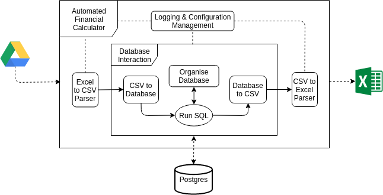

# EUHWC Automated Financial Calculator

A project to convert spreadsheets into a usable database to run database queries on the values and cut down cross-referencing time.

## Project Motivation

The idea behind the project is to automate the financial accounts of a university hillwalking club.
In moving our finances online, there was a large amount of cross-referencing various forms to check for payment
across trips, expenses and refunds. To help with this, the Automated Financial Calculator was created to reduce the amount
of time needed to manage various club spreadsheets.




The Automatic Financial Calculator works by processing the club's excel spreadsheet into a database, where custom SQL queries 
are run to aggregate the financial information of the club. This allows us to output an excel spreadsheet listing the key
financial information:
* the list of those in debt to the club
* the people the club owes money to
* the running totals of club expenditure

The app lists this information in a single outputted spreadsheet along with all the necessary contact and payment information needed to process the financials for the club.

## Project Structure 


````
.
├── app
│   ├── app_src
│   ├── run_app.py
│   └── sql_queries
├── config
│   ├── config.ini
│   └── google_drive_config
├── data
│   ├── input
│   │   ├── csv
│   │   └── spreadsheets
│   │       ├── finances
│   │       └── trips
│   └── output
│       ├── app_out.log
│       ├── csv
│       └── xlsx
├── docs
│   ├── _build
│   ├── make.bat
│   ├── Makefile
│   └── source
├── LICENSE
├── README.md
├── requirements.txt
└── scripts
    ├── reset_data.sh
    ├── run_app_backup.sh
    └── update_documentation.sh

````

The main entry point for running the app is `app/run_app.py`. The data to be processed needs to be added to 
`data/input/spreadsheets` and separated into the relevant folders.

Any change in the config of the app, whether to the app itself `config/config.ini` or the automatic google drive 
downloading `config/google_drive_config` can be made in the `config` folder. 

There are also a few scripts that may be useful for running and updating the app. These are found in `scripts`:
* `scripts/reset_data.sh` - deletes the current app data
* `scripts/run_app_backup.sh` - runs the app after starting the virtualenv, before uploading the app output to a 
secondary git repository (can be created inside `data/output`) to backup the output of the app
* `scripts/update_documentation.sh` - triggers the auto-build of the sphinx documentation for the app


## Setting up the app

### Dependencies

* Postgres Database
* PyPI modules (listed in requirements.txt)

To install a Postgres database please follow the installation instructions listed given [here](https://www.postgresql.org/docs/9.3/tutorial-install.html). 

The PyPI modules can be installed using pip by `pip3 install -r requirements.txt`. The use of a virtual environment for
managing the project's dependencies is recommended.

## Future work

There are some improvements that could be made to app in the future:
* the addition of a GUI - to make the app more accessible 
* improving the creation of the CSV by making this a configurable stage in the config.ini
* moving the custom sql away from the use of emails as a unique identifier (where one person can provide multiple),
moving instead to a system like fixed membership numbers
